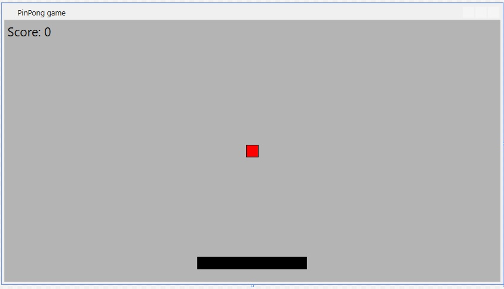

# PingPong Game

1st TW week exercise in .NET basics module

## Description

After I am ready with my task I would like to play all day with a simple game. I would like to have a ping pong game to play with my colleague to race.

## The vision

## Feature set

* Application is started and stopped normally
* Pressing ESC stops the the application
* With space it is paused
* Each touching with ball is scored
* Score is shown after I am done/stopped
* Score is visible contionusly
* Levels are defined (harder)
* Gifts can be reached
* Level is visibled
* Progress is shown in the level (procent)